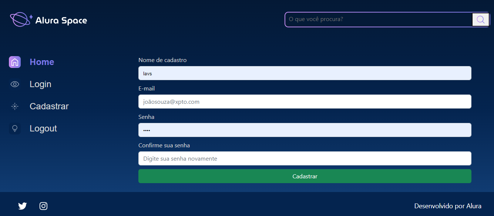
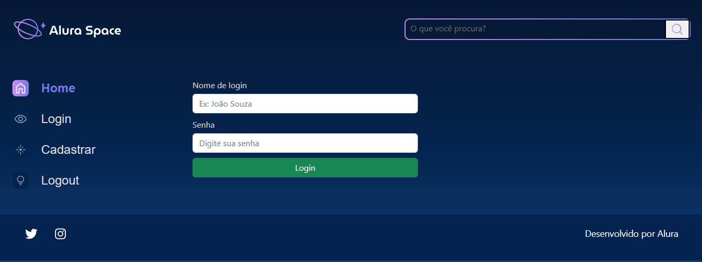
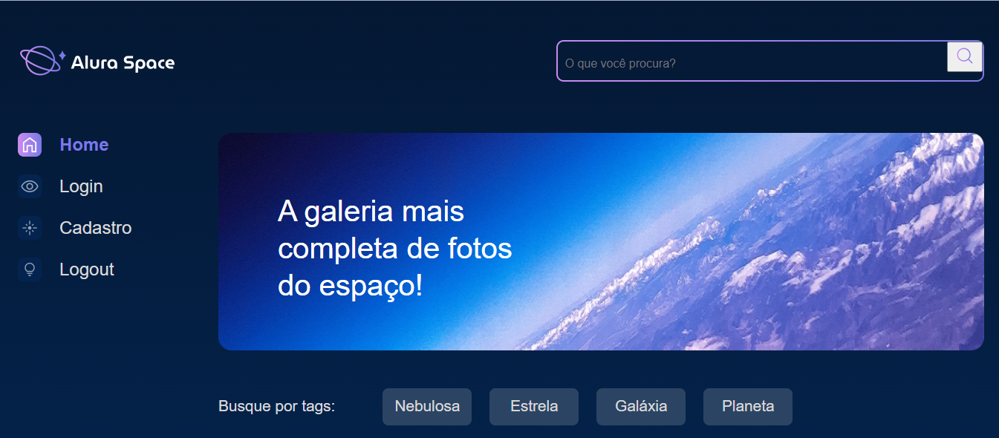
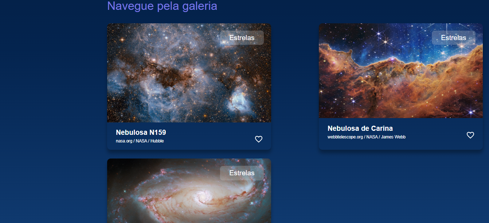
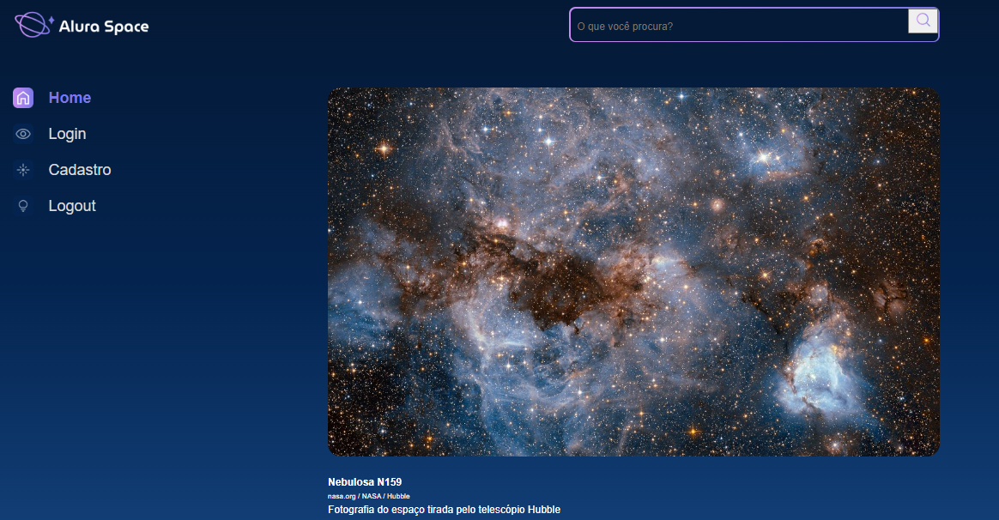
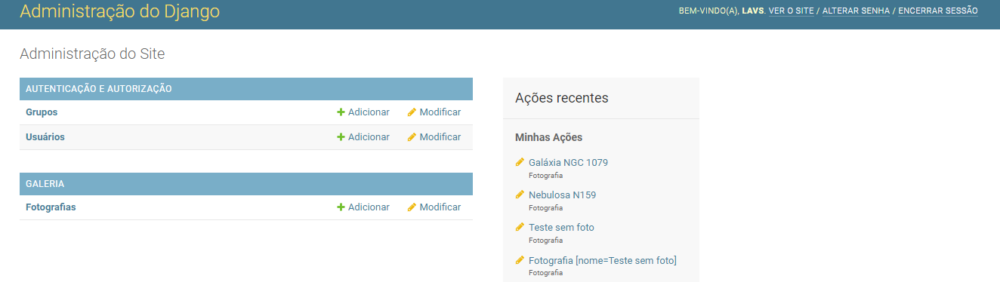
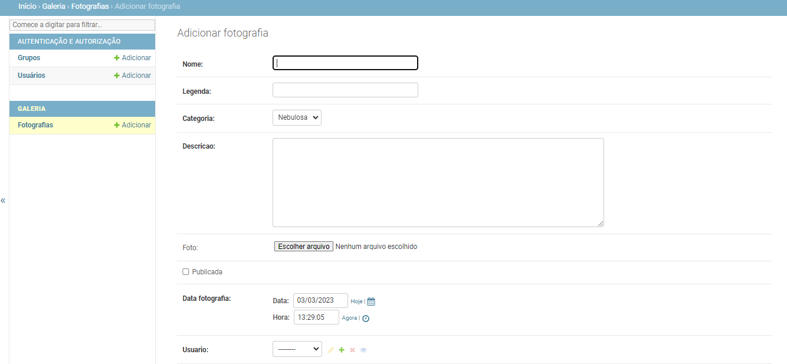

<h1 align="center"> ALURA SPACE (em desenvolvimento) </h1>

Projeto em desenvolvimento pela formação "Django: crie aplicações em Python" pela plataforma Alura. 
 

 

</img>

  <a href="#-sobre-o-projeto">Sobre o projeto</a>&nbsp;&nbsp;&nbsp;|&nbsp;&nbsp;&nbsp; 
  <a href="#-layouts">Layouts</a>&nbsp;&nbsp;&nbsp;|&nbsp;&nbsp;&nbsp;
  <a href="#-tecnologias">Tecnologias</a>&nbsp;&nbsp;&nbsp;&nbsp;&nbsp;&nbsp;

 

# Sobre o projeto

Alura Space é um projeto web voltado para o desenvolvimento back-end de uma galeria, utilizando o framework Django. O usuário deve se cadastrar e realizar o login para ter acesso à galeria. As fotos são disponibilizadas em cards com título e legenda. Ao clicar na imagem, o usuário deve ser redirecionado para uma página que mostra a imagem e suas inforamções. Além disso, cards de fotos podem ser armazenados no banco sem serem postados. O usuário define se gostaria de publicá-lo ou não. Ao realizar o logout, o usuário deve ser redirecionado para a página de login.

Para o projeto foi utilizado o ambiente virtual. 

# 📸 Layouts 

Tela de cadastro do usuário

</img>

Tela de login

</img>
 

Menu Home

</img>
 

Home

</img>
 

Imagem

</img>
 

Painel de administrador

</img>
 

Tela de cadastro dos cards

</img>
 

  

## 🚀 Tecnologias

Esse projeto foi desenvolvido com as seguintes tecnologias:
- Django
- Python
- Git e Github

# Autor

Lavínia Souza Silveira

https://www.linkedin.com/in/lav%C3%ADnia-silveira-896b2624a/
